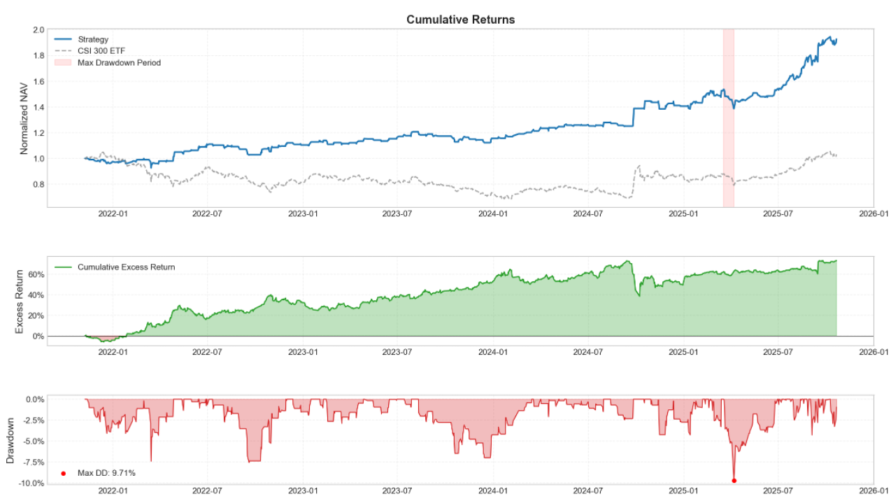
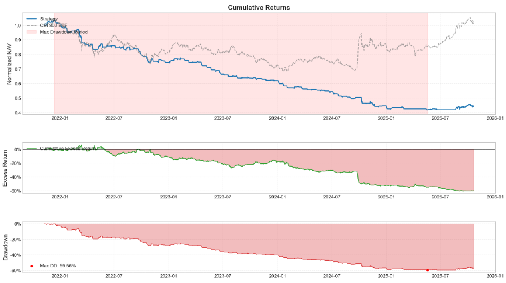
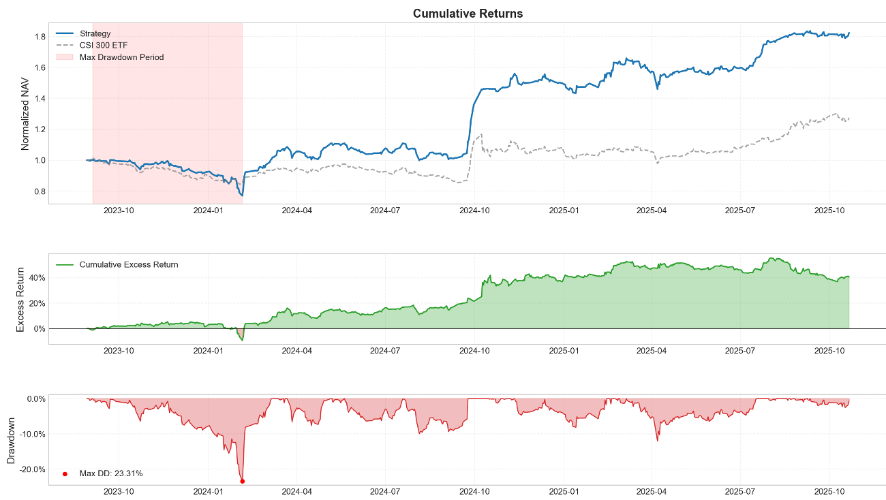
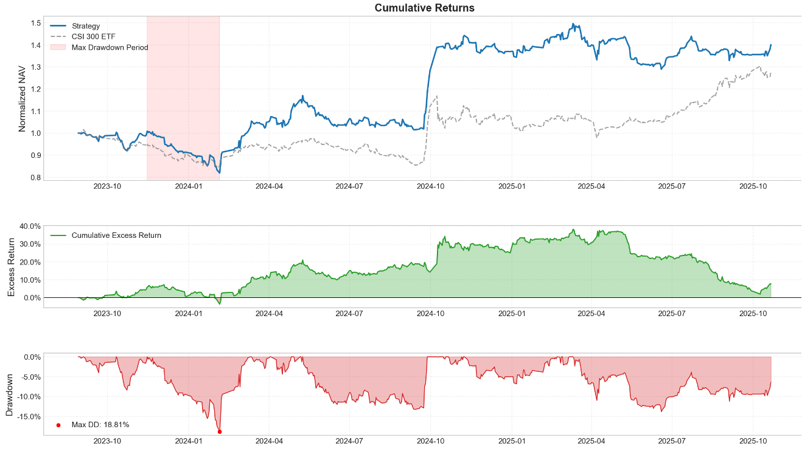

# Adaptive-Quant-PTree: Target Engineering & Dataset Pruning via Panel Trees

## 📌 Executive Summary
A common pitfall in financial forecasting is the "Garbage In, Garbage Out" (GIGO) effect, where noisy data and ill-defined targets contaminate model parameters. This project addresses two fundamental questions in quantitative research:
1.  **What to predict?** — Comparing classification vs. regression frameworks across different time horizons.
2.  **What to learn from?** — Implementing a **Panel Tree (P-Tree)** algorithm to isolate "predictable" regimes and high-quality data subsets.

By utilizing the **iTransformer** architecture and the **P-Tree optimization** methodology, this study achieves a significant boost in out-of-sample (OOS) Precision and strategy robustness, reaching a **Sharpe Ratio of 1.49** and an **Annualized Return of 34.12%** on A-share ETF cross-sectional rotation.

---

## 🛠 Methodology & Innovation

### 1. Predictive Target Engineering
We argue that "identifying direction is more robust than estimating magnitude." We conducted exhaustive experiments comparing:
- **Binary Classification**: Up/Down {0, 1}
- **Interval Classification**: Returns falling within predefined ranges (e.g., 1%-2%, >5%)
- **Regression**: Raw Returns (-L, L)
- **Time Horizons**: 1-day, 2-day, and 5-day intervals.

**Key Insight**: 5-day binary classification serves as the optimal target, providing a balance between signal persistence and turnover costs.

### 2. The P-Tree Optimization Algorithm (Core Innovation)
Financial time-series are non-stationary and heteroskedastic. To solve this, we implemented a customized **Panel Tree (P-Tree)** to partition the dataset:
- **Objective Function**: Maximize the difference in **Precision** (for classification) or **$R^2$** (for regression) between child nodes.
- **Economic Priors**: Nodes are split based on economically meaningful features such as Turnover, Premium Rate, and Idiosyncratic Volatility.
- **Pruning Strategy**: We discard "low-predictability" nodes that represent market noise, effectively denoising the training set and preventing parameter pollution.

### 3. Model Architecture: iTransformer
Leveraging the latest advancements in Time-Series Foundation Models, we employ **iTransformer**. By inverting the dimensions to treat each asset's series as an independent embedding, the model better captures global cross-correlations and multivariate dependencies in the ETF universe.

---

## 🔬 Experimental Analysis

### 3.1 Target Selection: Classification vs. Regression
Rigorous backtesting reveals that classification-based targets consistently outperform regression-based targets in directional accuracy and risk-adjusted returns.

| Target | Accuracy | Precision | Recall | F1-Score |
| :--- | :--- | :--- | :--- | :--- |
| **Up/Down (5d)** | **0.4898** | **0.4891** | **0.6036** | **0.5401** |
| Returns (5d) | 0.4827 | 0.3222 | 0.5805 | 0.4142 |

### 3.2 Dataset Optimization: The P-Tree Impact
Applying P-Tree pruning significantly enhances the out-of-sample Signal-to-Noise ratio.

| Task | Post-Optimization Precision | Pre-Optimization Precision | Delta |
| :--- | :--- | :--- | :--- |
| **2-Day Horizon** | **0.5400** | 0.4887 | **+10.5%** |
| **5-Day Horizon** | **0.5469** | 0.4891 | **+11.8%** |

---

## 📈 Strategy Backtest: ETF Cross-Sectional Rotation

### Before PTree Data Pruning

If we delay position establishment by one day, we end up with two significantly different return curves.

The result below is caused by delaying position establishment by one day.

### Performance after Data Pruning (Out-of-Sample)
- **Timeframe**: 2023-11-08 to 2025-10-20
- **Universe**: A-share ETF Daily Data
- **Transaction Costs**: 10 bps (one-way)
- **Execution**: T+1 Open price based on signal strength.

| Metric | Optimized Strategy |
| :--- | :--- |
| Annualized Return | 34.12% |
| Sharpe Ratio | 1.49 |
| Max Drawdown | 23.31% |
| Calmar Ratio | 1.46 |
| Win Rate | 53.11% |

**If we delay position establishment by one day, we have a more robust backtest result.**

### Robustness & Latency Analysis
A critical finding of this research is the **Execution Sensitivity**. By implementing the P-Tree optimization, the strategy's dependence on immediate execution is mitigated. The Sharpe Ratio remains robust (**0.92**) even with a 1-day execution delay, proving the model captures structural "Long-Memory" alpha rather than fleeting noise.

---

